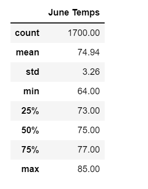
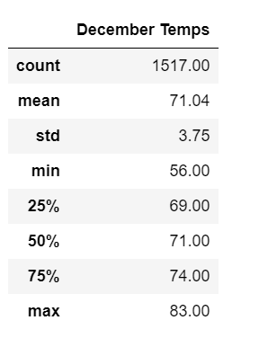
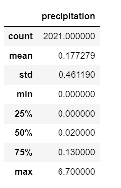

# Overview of Analysis
The purpose of this analysis was to uncover temperature statistics for June and December in Hawaii to see if it was possible to run a year round two for one surf and icecream shop.
By accessing meterological data in an SQLite file, we were able to write queries to examine temperature data collected for months of June and December and calculate their summary statistics.

# Results
By running a fairly similar analysis for both months, we were able to easily determine that Oahu is an ideal location for a year round surf and icecream shop. 
* With Summer and Winter temperatures differing by less than 4 degrees on average, this shows that the year round weather is pretty consistent. 
* With max temperatures of 83 and 85 degrees, this is ideal beach weather without being unbearable hot. 
* A low of 55 in the middle of winter is still perfect icecream weather (when isn't perfect icecream weather) and the waves will still be relatively same temperature as they were in June!

# Summary
Based off our analysis of the temperatures in June and December, we can see that the lows are rarely too low and the highs are still bearable.
While temperature alone does not determine the favorablity of a location, we can also conclude that there is little precipitation in Oahu (analysis performed in climate_analysis.ipynb)

Some additional variables I would consider in location optimality would be patterns in the wave swells and wind patterns. There are varying characteristics of an optimal beach day depending on the customer--an icecream loving sunbather may not necessarily consider the wave conditions when going to the beach as an avid surfer would. 
To conclude, Oahu is a great investment location for a surf and icecream shop. There are many additional factors to be considered here, but at a surface level we can see that the temperatures are relatively the same year round.
